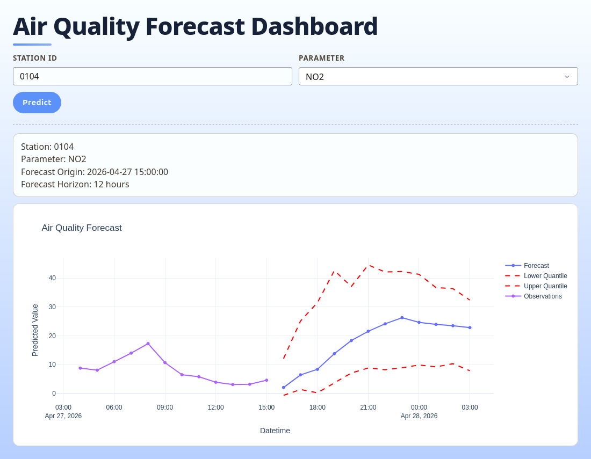

# AirQuality 🌫️

End-to-end machine learning project for short-term NO2 forecasting in Hessen (Germany), based on open data from the [HLNUG Luftmessnetz Hessen](https://www.hlnug.de/messwerte/datenportal) platform.

> ℹ️ The model used in this project is intentionally simple — a lightweight MLP trained as a proof of concept for the full pipeline. Model quality, benchmarks, and proper evaluation metrics will be added in a future iteration.

This project covers the full stack, from raw API data to an interactive forecast dashboard:
- 📡 data collection from official monitoring APIs
- 🔧 preprocessing and time-series feature engineering
- 🧠 neural network training (point and quantile regression)
- 🚀 model serving with FastAPI
- 📊 interactive visualization with Dash

## Tech Stack

| Layer | Technology |
|---|---|
| Language | Python 3.12 |
| Data | pandas, pyarrow (Parquet) |
| ML | PyTorch, scikit-learn |
| Training config | Pydantic Settings |
| Experiment tracking | TensorBoard |
| API | FastAPI + uvicorn |
| Dashboard | Dash + Plotly |
| Dependency management | uv |
| Linting / Type checking | ruff, mypy |

## About the HLNUG Dataset

The data comes from the Hessian air quality monitoring network ([Luftmessnetz Hessen](https://www.hlnug.de/messwerte/datenportal)), operated by the Hessian State Office for Nature Conservation, Environment and Geology (HLNUG). It covers over 100 monitoring stations across the federal state of Hessen, Germany.

Data retrieved in this project:
- **Station metadata** — station ID, name, coordinates, station environment type (e.g. urban traffic), and active measurement window
- **Hourly measurements** — NO2, temperature, humidity, and wind speed per station
- **Parameter metadata** — HLNUG parameter IDs, display names, and units

How data is stored and processed for model training:
- raw hourly data is fetched from HLNUG endpoints and persisted as partitioned Parquet files under `project_data/raw/`
- a SQLite chunk manifest tracks which months have been downloaded to avoid redundant requests
- processed train/validation/test splits are saved to `project_data/processed/`
- a StandardScaler and station-to-integer mapping are persisted as artifacts for consistent inference

## Quick Start

### 1. Install dependencies

Using uv (recommended):

```bash
uv sync
```

Or with pip:

```bash
python -m venv .venv
source .venv/bin/activate
pip install -e .
```

### 2. Configure

Copy the template and edit values as needed:

```bash
cp example.env .env
```

The training config automatically reads `.env` when available.

## Train Your Own Model

Run from repository root:

```bash
uv run -m scripts.train
```

What happens during training:
1. Stations are selected for the configured date range.
2. Data is optionally fetched from HLNUG.
3. Features and targets are generated.
4. Model training runs and logs to TensorBoard.
5. A checkpoint is saved to `output/model_checkpoint.pth`.

Monitor training:

```bash
uv run tensorboard --logdir runs
```

## Run the API Service

```bash
uv run uvicorn api.app:app --reload
```

Docs:
- Swagger UI: http://127.0.0.1:8000/docs
- ReDoc: http://127.0.0.1:8000/redoc

Main endpoints:
- `GET /predictions` — multi-step NO2 forecast for a station
- `GET /observations` — recent observed values for comparison

Example:

```bash
curl "http://127.0.0.1:8000/predictions?station_id=0104&dt=2026-03-06T18:00:00&parameter=NO2"
```

## Run the Dashboard

With the API running:

```bash
uv run python -m dashboard.app
```

Open http://127.0.0.1:8050, select a station ID and parameter, then click **Predict**.



## Configuration

Key environment variables (see `example.env` for the full template):

| Variable | Default | Description |
|---|---|---|
| `MODEL_TYPE` | `quantile` | `simple` or `quantile` |
| `FORECAST_HORIZON` | `12` | Forecast steps in hours |
| `NUM_EPOCHS` | `10` | Training epochs |
| `LR` | `0.001` | Learning rate |
| `LAGS` | `[1,2,3,6,12,24]` | Lag feature offsets |
| `START` | `2026-01-01T00:00:00` | Training data start |
| `END` | `2026-03-31T00:00:00` | Training data end |
| `RETRIEVE_NEW_MEASUREMENTS` | `true` | Fetch from HLNUG |
| `SELECT_FEATURES` | `false` | Run greedy feature selection |

## 🔮 Future Improvements

### Model
The current model is a small MLP used to validate the end-to-end pipeline. It will be replaced with a more capable architecture. Planned for a future iteration:
- refined model architecture
- proper evaluation metrics included in this README
- multi-parameter forecasting beyond NO2

### Dashboard
- station details panel (name, location, environment type)
- interactive station map
- overlay of official EU/German pollutant limits for visual context

### Infrastructure
- automated test suite (unit + integration)
- containerized deployment

---

© 2026 Lena Perzlmaier · [MIT License](LICENSE) · Developed with the assistance of [GitHub Copilot](https://github.com/features/copilot)
